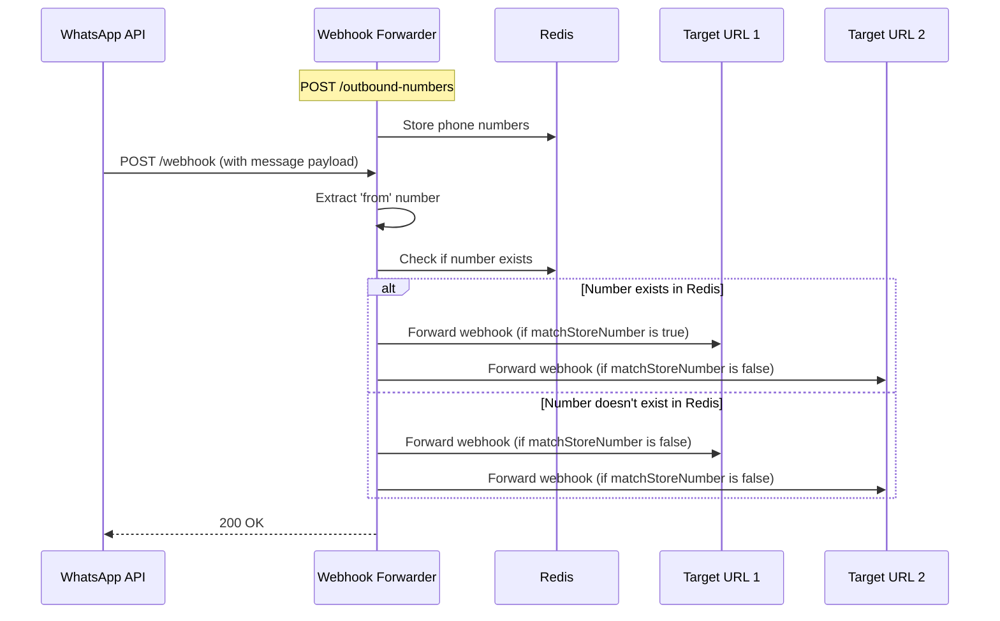

```mermaid
sequenceDiagram
    participant WhatsApp API
    participant Webhook Forwarder
    participant Redis
    participant Target URL 1
    participant Target URL 2

    Note over Webhook Forwarder: POST /outbound-numbers
    Webhook Forwarder->>Redis: Store phone numbers
    WhatsApp API->>Webhook Forwarder: POST /webhook (with message payload)
    Webhook Forwarder->>Webhook Forwarder: Extract 'from' number
    Webhook Forwarder->>Redis: Check if number exists
    alt Number exists in Redis
        Webhook Forwarder->>Target URL 1: Forward webhook (if matchStoreNumber is true)
        Webhook Forwarder->>Target URL 2: Forward webhook (if matchStoreNumber is false)
    else Number doesn't exist in Redis
        Webhook Forwarder->>Target URL 1: Forward webhook (if matchStoreNumber is false)
        Webhook Forwarder->>Target URL 2: Forward webhook (if matchStoreNumber is false)
    end
    Webhook Forwarder-->>WhatsApp API: 200 OK
```