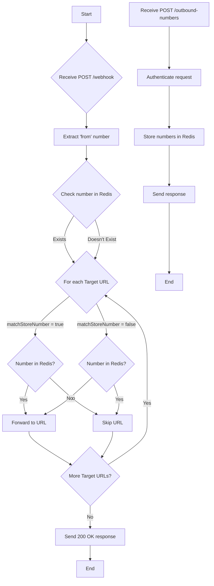

```mermaid
flowchart TD
    A[Start] --> B{Receive POST /webhook}
    B --> C[Extract 'from' number]
    C --> D{Check number in Redis}
    D -->|Exists| E{For each Target URL}
    D -->|Doesn't Exist| E
    E -->|matchStoreNumber = true| F{Number in Redis?}
    F -->|Yes| G[Forward to URL]
    F -->|No| H[Skip URL]
    E -->|matchStoreNumber = false| I{Number in Redis?}
    I -->|No| G
    I -->|Yes| H
    G --> J{More Target URLs?}
    H --> J
    J -->|Yes| E
    J -->|No| K[Send 200 OK response]
    K --> L[End]

    M[Receive POST /outbound-numbers] --> N[Authenticate request]
    N --> O[Store numbers in Redis]
    O --> P[Send response]
    P --> Q[End]
```