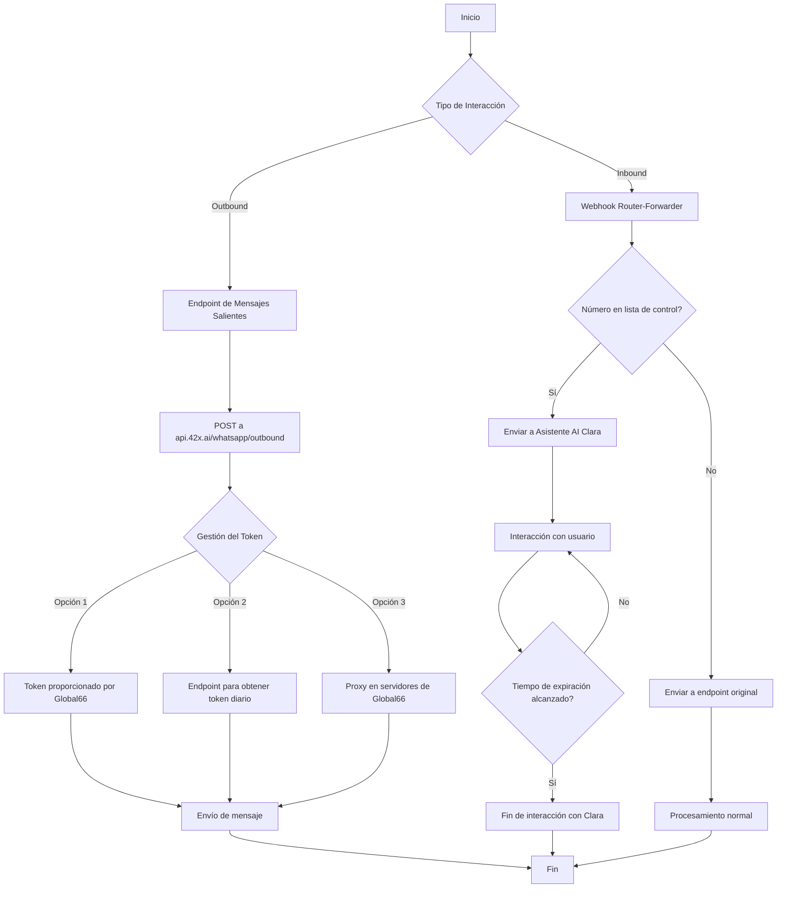

```mermaid
graph TD
    A[Inicio] --> B{Tipo de Interacción}
    B -->|Outbound| C[Endpoint de Mensajes Salientes]
    B -->|Inbound| D[Webhook Router-Forwarder]
    
    C --> E[POST a api.42x.ai/whatsapp/outbound]
    E --> F{Gestión del Token}
    F -->|Opción 1| G[Token proporcionado por Global66]
    F -->|Opción 2| H[Endpoint para obtener token diario]
    F -->|Opción 3| I[Proxy en servidores de Global66]
    
    D --> J{Número en lista de control?}
    J -->|Sí| K[Enviar a Asistente AI Clara]
    J -->|No| L[Enviar a endpoint original]
    
    K --> M[Interacción con usuario]
    M --> N{Tiempo de expiración alcanzado?}
    N -->|No| M
    N -->|Sí| O[Fin de interacción con Clara]
    
    L --> P[Procesamiento normal]
    
    G --> Q[Envío de mensaje]
    H --> Q
    I --> Q
    
    Q --> R[Fin]
    O --> R
    P --> R
```